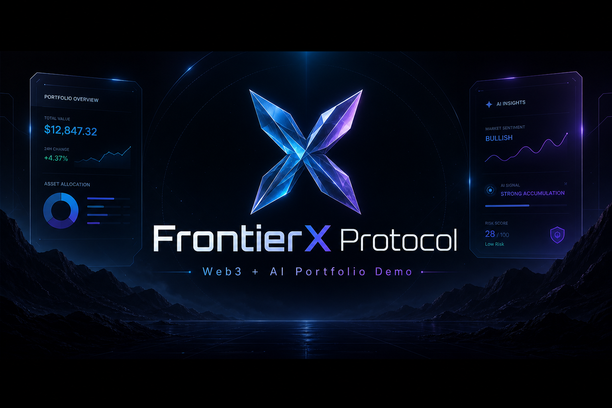
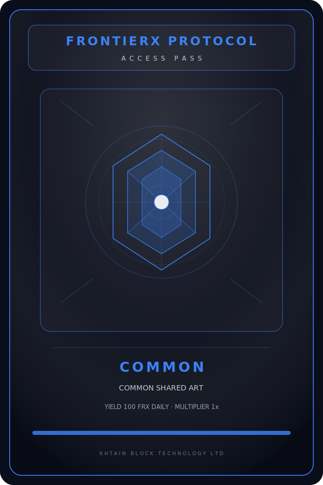
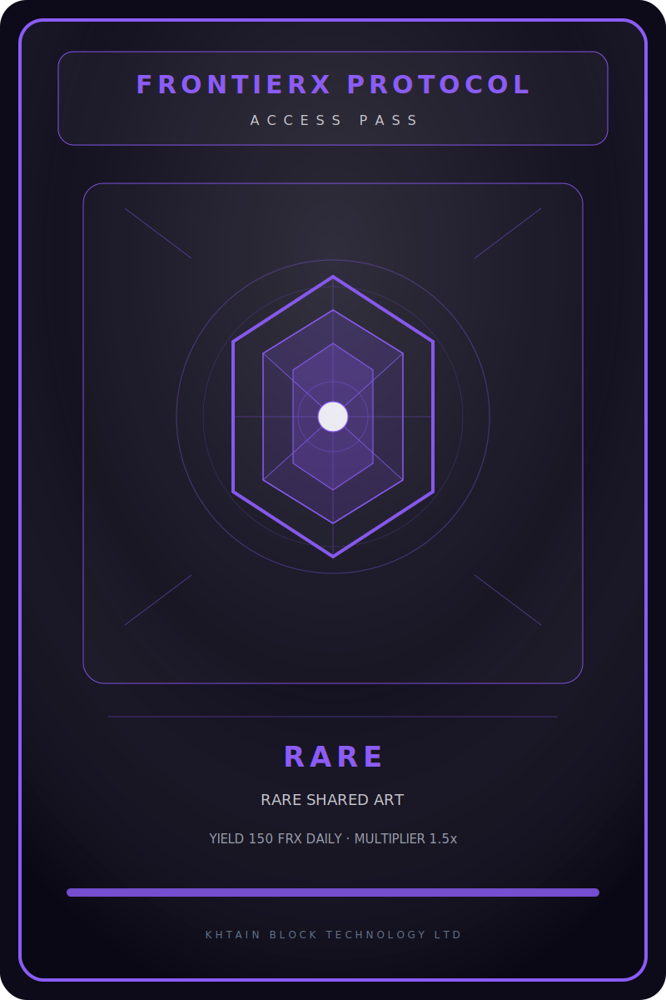
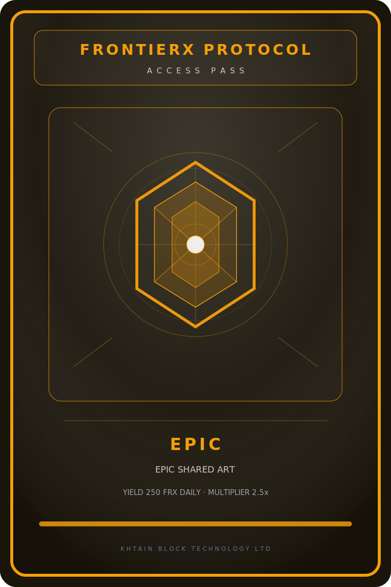
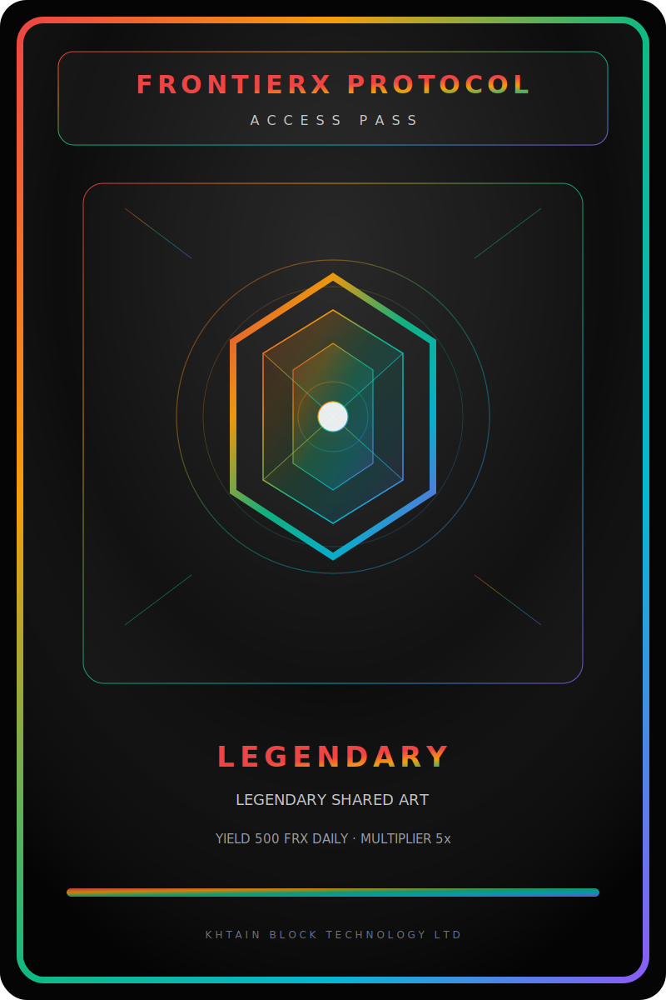
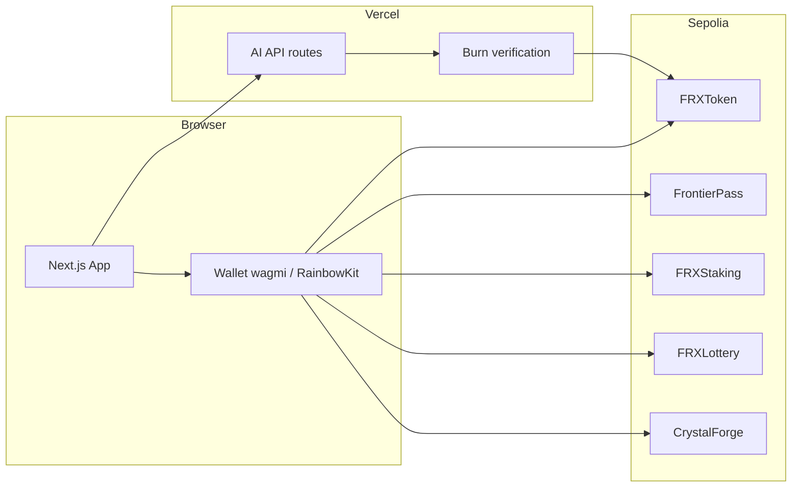

# FrontierX Protocol

<p align="center">
  
</p>

<p align="center">
  <strong>Portfolio-grade Web3 + AI demo</strong> — ERC-20 utility, ERC-721 access passes, staking rewards, token games, NFT-gated areas, and burn-gated AI agents on one stack.
</p>

<p align="center">
  <a href="https://frontierweb3.khtain.com"></a>
  <a href="https://frontierx-web3.vercel.app"></a>
  
  
</p>

---

## Live demo

| Surface | URL |
|--------|-----|
| **Production (custom domain)** | [https://frontierweb3.khtain.com](https://frontierweb3.khtain.com) |
| Vercel default | [https://frontierx-web3.vercel.app](https://frontierx-web3.vercel.app) |

Connect a wallet on **Sepolia**, fund with test ETH, and use demo FRX from staking / faucet flows documented in the repo.

> **Testnet only.** Do not send mainnet funds. Mint on the current Sepolia deploy is closed (1/100 revealed).

---

## Product snapshot

<p align="center">
  
</p>

| Module | What it does |
|--------|----------------|
| **FRX (ERC-20)** | Staking rewards, game stakes, AI burn payments |
| **Frontier Pass (ERC-721)** | Rarity tiers, IPFS metadata, holder-only areas |
| **Staking** | Lock NFTs → earn FRX over time |
| **Crystal Lottery** | Approve + enter (≥10 FRX) → timed draw |
| **Crystal Forge** | 4-step flow: approve → forge (5 FRX) → wait 1 block → settle |
| **AI Hub** | Server verifies on-chain FRX burn before LLM responses |

### NFT art (local previews)

<p align="center">
  
  
  
  
</p>

On-chain metadata base URI (Sepolia): `ipfs://bafybeigf6popixfc6pq3mbvzkkiqux7te2wvhhi4v6lqm54dfmyia7tda4/nft-metadata/`

---

## Architecture



---

## Sepolia contracts (current deploy)

| Contract | Address | Etherscan |
|----------|---------|-----------|
| FRXToken | `0xeD710ff884e9a46d2d96555f80225AE801c94C1D` | [View](https://sepolia.etherscan.io/address/0xeD710ff884e9a46d2d96555f80225AE801c94C1D) |
| FrontierPass | `0x6fAC02B2c00A49eC6D893455AE65256d7E8836B7` | [View](https://sepolia.etherscan.io/address/0x6fAC02B2c00A49eC6D893455AE65256d7E8836B7) |
| FRXStaking | `0xe5d76b7a5ab7e1ADDf707Fa6aF980345440aBAD2` | [View](https://sepolia.etherscan.io/address/0xe5d76b7a5ab7e1ADDf707Fa6aF980345440aBAD2) |
| FRXLottery | `0x9976F14605352E09231bBF2DA0Fb61a4FD049F68` | [View](https://sepolia.etherscan.io/address/0x9976F14605352E09231bBF2DA0Fb61a4FD049F68) |
| CrystalForge | `0x4739cE88ab7F557Ee385F5208b2C616510F4CD53` | [View](https://sepolia.etherscan.io/address/0x4739cE88ab7F557Ee385F5208b2C616510F4CD53) |

Canonical JSON: [`frontierx-contracts/deployments/addresses.json`](frontierx-contracts/deployments/addresses.json)

**Crystal Forge V1 outcomes:** 50% Shatter · 25% Glow · 15% Blaze · 10% Supernova (3× payout).

---

## Repository layout

| Path | Purpose |
|------|---------|
| `frontierx-contracts/` | Hardhat + OpenZeppelin contracts, deploy scripts, tests |
| `frontierx-web/` | Next.js App Router frontend + API routes |
| `doc/` | Specs, runbooks, deployment notes (public subset) |
| `scripts/` | Vercel env sync, Sepolia health checks |
| `docker-compose.yml` | Local web (`9830`) + Hardhat node (`9831`) |

---

## Local development

```bash
# From repo root — Docker (recommended on Windows)
docker compose up --build
# Web → http://localhost:9830
```

```bash
# Or run services separately
cp .env.example .env   # fill keys; never commit .env
cd frontierx-contracts && npm ci && npx hardhat test
cd frontierx-web && npm ci && npm run dev
```

Environment variables: see `.env.example`. Production secrets stay in Vercel; use `node scripts/push-vercel-env.mjs` only from a trusted machine.

**Vercel monorepo:** set project **Root Directory** to `frontierx-web` (root `vercel.json` also supports Git builds).

---

## Verification checklist (maintainers)

| Check | Status (2026-06-01) |
|-------|---------------------|
| Production HTTPS | `frontierweb3.khtain.com` → **200** |
| AI burn guard | `GET /api/ai/status` → `burnConsumptionReady: true` |
| Lottery on-chain | Round 1 · pool **10 FRX** · **1** entry |
| Forge on-chain | Plays recorded; settle flow exercised on Sepolia |
| Etherscan verified source | **Pending** — run `npx hardhat verify` per `doc/05-DEPLOYMENT.md` |

Arena play guides: [`doc/ARENA-HOW-TO-PLAY.md`](doc/ARENA-HOW-TO-PLAY.md) · Sepolia runbook: [`doc/LOCAL-SEPOLIA-TEST-RUNBOOK.md`](doc/LOCAL-SEPOLIA-TEST-RUNBOOK.md)

---

## What this project demonstrates

- Full-stack Web3: Solidity, Hardhat, TypeScript tests, deployed testnet addresses
- Wallet UX: chain switching, approvals, pending/success/error states (wagmi v2 + RainbowKit)
- Token economics wired to games and AI (burn-before-response)
- IPFS NFT metadata with quota-aware upload workflow
- Production deploy: Vercel + custom domain on GoDaddy

---

## Disclaimer

This is a **demonstration / portfolio** project on **testnets**. Randomness in Crystal Forge is demo-grade (not Chainlink VRF). No investment advice. Do not deploy to mainnet or use real funds without explicit review and your own security audit.

---

## License

See repository license file if present; otherwise treat as portfolio source — contact the owner before commercial reuse.

<p align="center">
  <sub>Built with FrontierX — command-center UI, controlled neon, glass surfaces.</sub>
</p>
